搭建cygwin开发环境
=====================================
## cygwin中编译/调试c/c++
### cygwin的安装
1. 访问官方网站 https://cygwin.com
2. 下载安装器 https://cygwin.com/setup-x86_64.exe
3. 任何时候都可以运行安装器给cywin添加命令
4. 选择cygwin的安装目录。不要有中文；为了避免麻烦，最好不要很深的目录。考虑cygwin是作为系统工具来使用，我将其安装在c盘的一级目录中
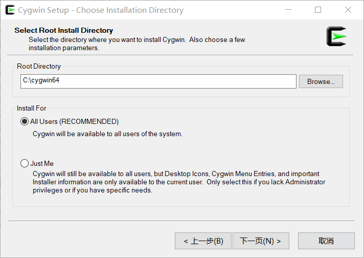
5. 选择下载文件存放目录。cygwin下载的源代码等会存放在该目录。前面有个选项，询问是从internet上安装还是本地安装，如果以前下载过cygwin的文件，可以选择本地安装。这个目录作为存档数据目录，我设置为d盘下的cygwin一级目录。
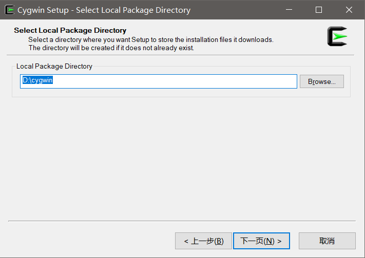
6. 选择下载网址。在国内可以选择163或者aliyun
https://mirrors.aliyun.com/cygwin/
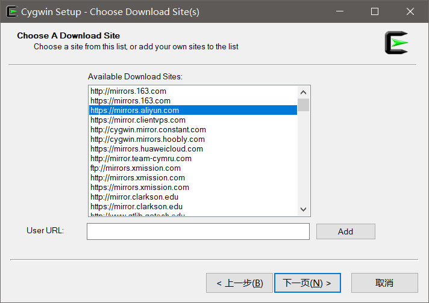
7. 选择cygwin中要安装的软件。
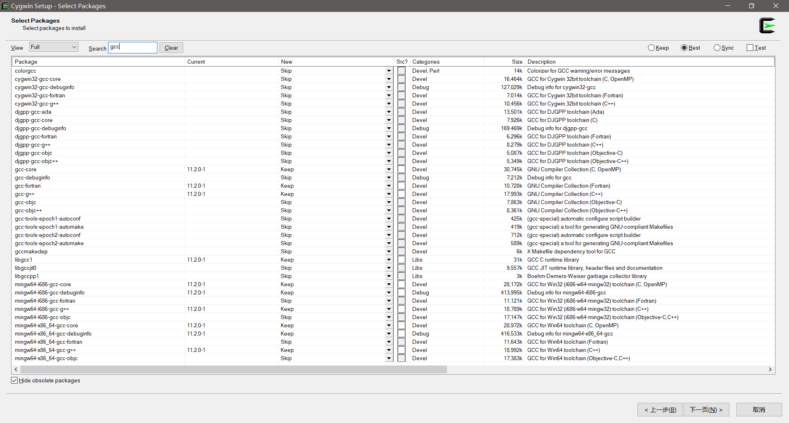
由于主要用cygwin做跨平台开发，我安装了
>vim
>gcc,g++,gdb
>mingw套装

8. 安装完成后询问是否在桌面创建快捷方式，由于经常使用，选择Yes.用会计方式，启动cygwin控制台(bash)，运行常用命令，以检查cygwin是否正常运行
```bash
cd /
ls
```
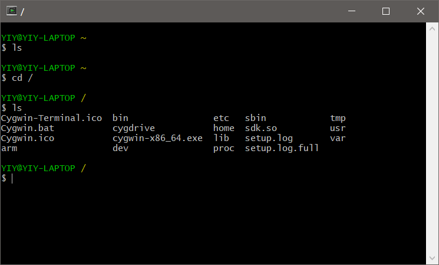

### 使用gcc编译windows可执行文件
#### 测试gcc是否可用
在终端中输入命令
```bash
gcc -v
```
如果cygwin安装成功gcc，应该显示如下画面:
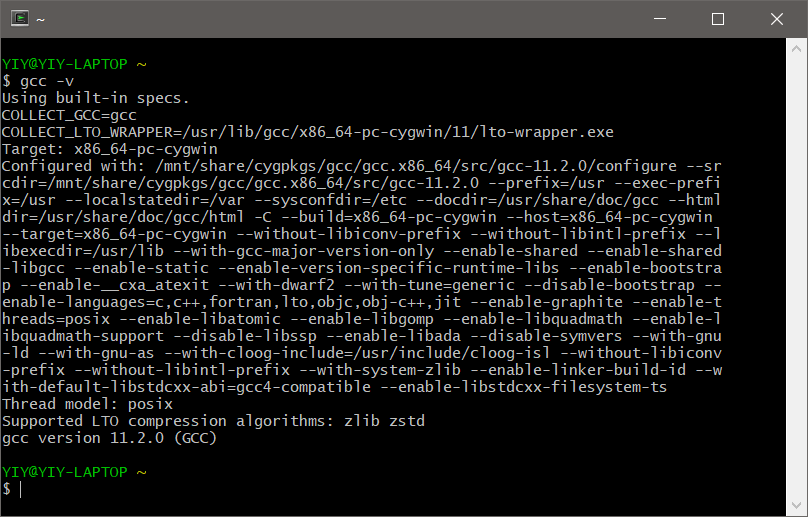
如果不正确，要再次调用[安装器](https://cygwin.com/setup-x86_64.exe),搜索gcc，安装gcc,g++等编译器
#### 创建目录与源文件
1. 在windows中创建目录D:\fact\studies\cywin
2. 在cywin终端中输入
```bash
cd /cygdrive/D/fact/studies/cywin/
```
**windows的各个盘符被cygwin挂载到了/cygdrive,对windows的其他非cygwin根目录里的文件的访问，都可以通过/cygdrive/C/这种方式**
3. 在该目录下创建hello.c
```bash
vim hello.c
```
按i字母键后进入INSERT编辑模式
4. 用vim输入以下代码
```c
#include <stdio.h>
int main(int argc,char** argv){
	printf("%s","hello world!");
	return 0;
}
```
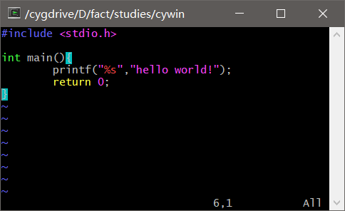
输入完成后按ESC，然后按:,然后输入wq存盘退出
#### 用gcc编译hello.c
在cygwin终端运行编译命令
```bash
gcc hello.c -o hello
```
#### 运行hello程序
在cygwin终端运行编译命令
```bash
./hello
```
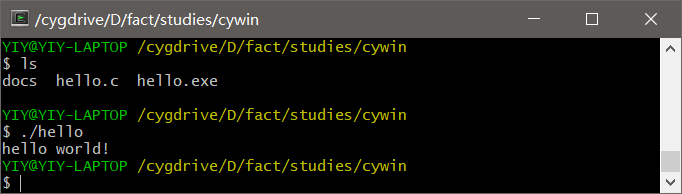

### 在windows中执行hello
直接在windows中执行hello.exe会出现以下错误
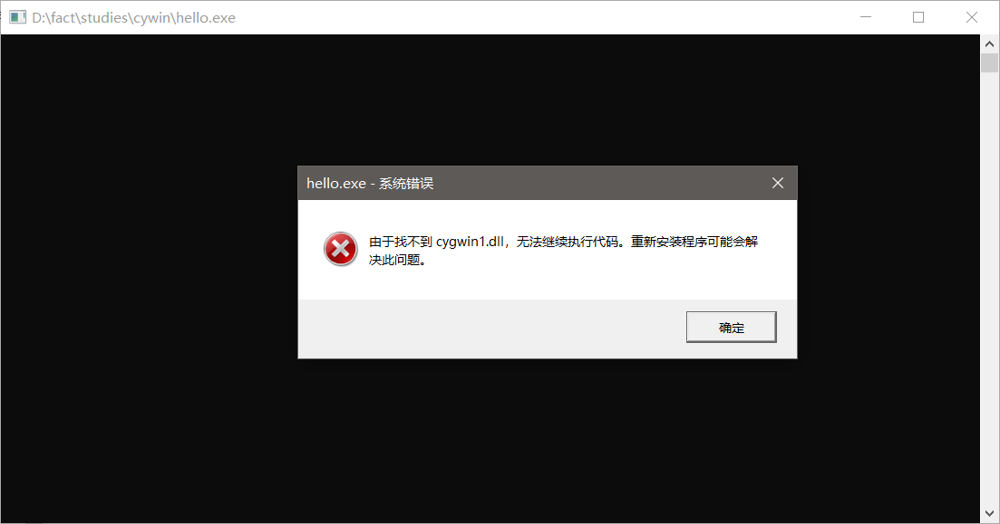
将 c:\cygwin64\bin\cygwin1.dll 拷贝到hello.exe相同的目录再执行
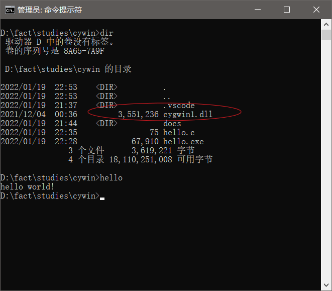

### 调用gdb调试代码
#### 在cygwin终端用vim创建一个复杂点的c程序，并用-g参数编译
```c
#include <stdio.h>

int calc(int i) {
	int k = 3;
	k +=i;
	i=k*i;
	return i;
}

int main(int argc, char** argv){
	int i=2;
	printf("input a number:");
	// scanf("%i", i);
	int result = calc(i);
	printf("result: %i", result);
}
```
调用gcc用debug方式编译
```bash
gcc -ggdb -o calc calc.c
```
**注意:要加-g参数，表示生成调试版本。如果没有加-g参数，gcc不会生成符号表，后面gdb显示出来都是内存地址**
如果只加-g参数，只生成内核符号信息，-ggdb生成 gdb的符号表

#### 启动gdb
执行终端命令
```bash
gdb ./calc
```
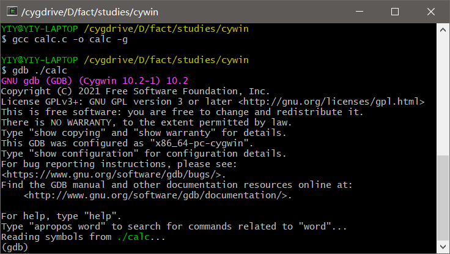
#### 用gdb命令调试程序
以下步骤都是在gdb中调用gdb命令。标题中的命令为命令全名，代码中都使用命令短名。
1. 用list命令查看查看源代码
```gdb
l
```
一次只显示10行
如果要查看更多的源代码，可以直接按回车，表示重复前面的命令
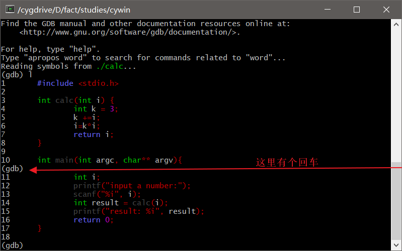

2. 用break命令设置断点
我们期望在函数main入口处暂停程序执行
```gdb
b main
```
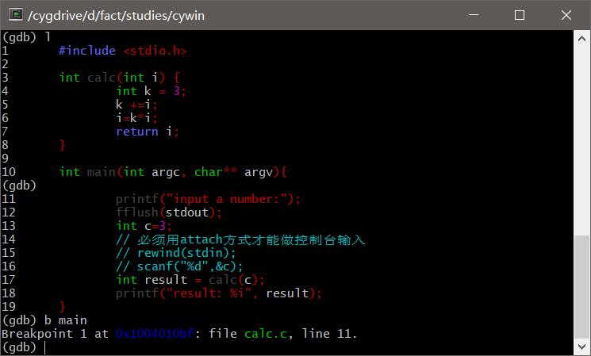
3. run启动调试
并在断点处中断程序执行
```gdb
r
```
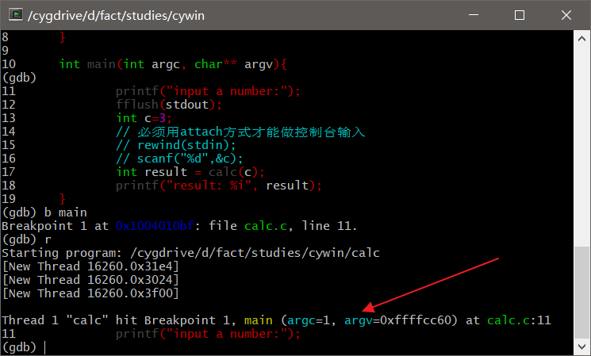
4. 用step单步调试
让程序运行完成断点所在行，并在下一行停止。
```gdb
s
```
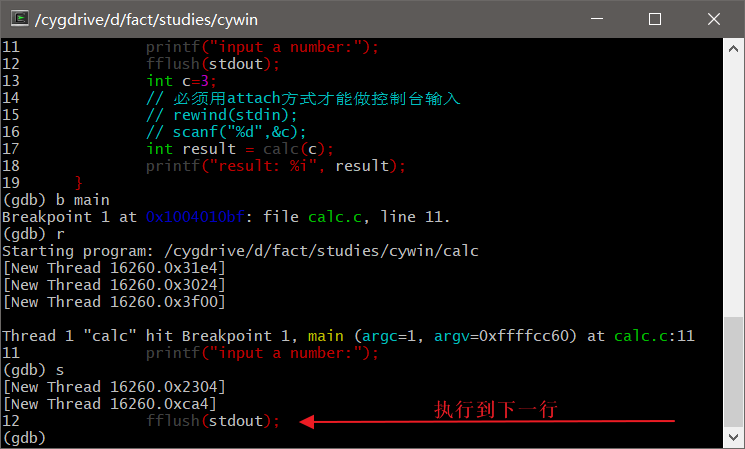
5. print查看变量
用单步调试，执行到13行之后,即int c=3;之后,执行以下gdb命令，查看变量的值
```gdb
p s
```
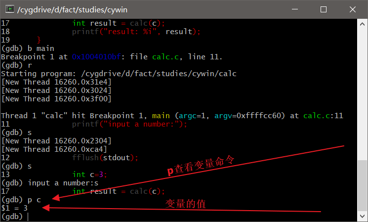
6. 退出gdb
```gdb
q
```

## vscode集成cygwin搭建开发环境
本节完成后，在vscode中应该看到如下目录结构与文件
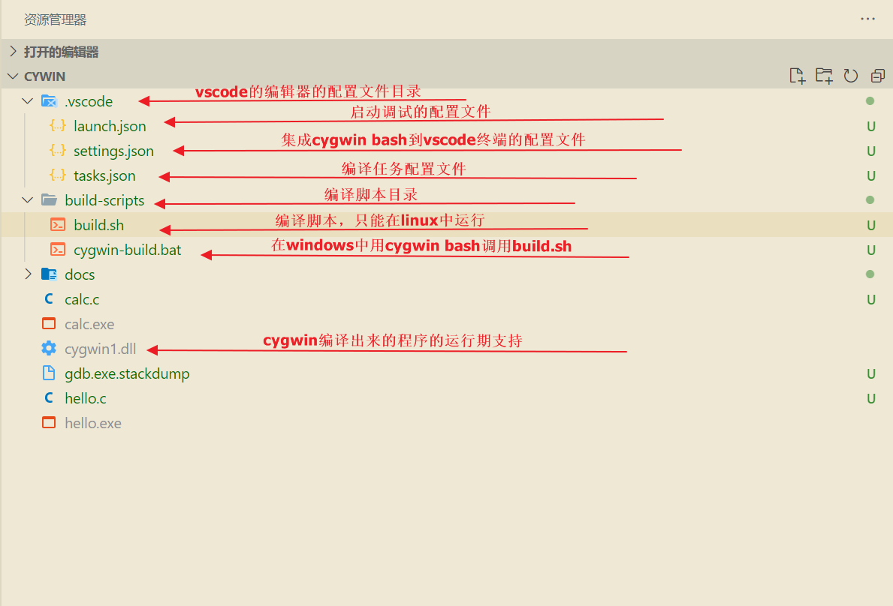
### 安装vscode与插件
1. 安装vscode
2. 安装c++插件包
扩展->搜索 C/C++ Extension Pack
安装
### 集成cygwin到vscode的内置终端[^vscode_integrated_terminal]
1. 在项目根目录创建.vscode目录
2. 在.vscode中创建settings.json
3. 在settings.json中录入以下内容
```json
{
	//集成cygwin bash到vscode的终端
"terminal.integrated.shell.windows": "C:\\cygwin64\\bin\\bash.exe",
// 使得 cygwin 切换到当前工作目录
"terminal.integrated.env.windows": {
    "CHERE_INVOKING": "1"
},
// 使 cygwin 能够在 vscode 中正常使用 Shell 命令
"terminal.integrated.shellArgs.windows": [
    "-l"
],
	"files.associations": {
		"iostream": "cpp",
		"xstring": "cpp",
		"ostream": "cpp",
		"atomic": "cpp",
		"bit": "cpp",
		"cctype": "cpp",
		"clocale": "cpp",
		"cmath": "cpp",
		"compare": "cpp",
		"concepts": "cpp",
		"cstddef": "cpp",
		"cstdint": "cpp",
		"cstdio": "cpp",
		"cstdlib": "cpp",
		"cstring": "cpp",
		"ctime": "cpp",
		"cwchar": "cpp",
		"exception": "cpp",
		"fstream": "cpp",
		"initializer_list": "cpp",
		"ios": "cpp",
		"iosfwd": "cpp",
		"istream": "cpp",
		"iterator": "cpp",
		"limits": "cpp",
		"map": "cpp",
		"memory": "cpp",
		"new": "cpp",
		"sstream": "cpp",
		"stdexcept": "cpp",
		"streambuf": "cpp",
		"string": "cpp",
		"system_error": "cpp",
		"tuple": "cpp",
		"type_traits": "cpp",
		"typeinfo": "cpp",
		"utility": "cpp",
		"vector": "cpp",
		"xfacet": "cpp",
		"xiosbase": "cpp",
		"xlocale": "cpp",
		"xlocinfo": "cpp",
		"xlocnum": "cpp",
		"xmemory": "cpp",
		"xstddef": "cpp",
		"xtr1common": "cpp",
		"xtree": "cpp",
		"xutility": "cpp",
		"array": "cpp",
		"*.tcc": "cpp",
		"cstdarg": "cpp",
		"cwctype": "cpp",
		"deque": "cpp",
		"unordered_map": "cpp",
		"algorithm": "cpp",
		"functional": "cpp",
		"memory_resource": "cpp",
		"numeric": "cpp",
		"optional": "cpp",
		"random": "cpp",
		"string_view": "cpp",
		"cinttypes": "cpp",
		"chrono": "cpp",
		"ratio": "cpp",
		"bitset": "cpp",
		"condition_variable": "cpp",
		"regex": "cpp",
		"mutex": "cpp",
		"shared_mutex": "cpp",
		"thread": "cpp"
	}
}
```
### 集成编译任务
#### 创建编译脚本目录
终端执行创建目录命令
cygwin bash:
```shell
mkdir build-scripts
```
windows cmd:
```cmd
md build-scripts
```
#### 创建linux bash的编译脚本
在build-scripts中创建文件build.sh
```bash
#!/bin/bash
# 获取并跳转到工作目录
buildScriptFolder=$(dirname "$0")
workspaceFolder="$buildScriptFolder/.."
cd "$workspaceFolder" || exit
workspaceFolder=$(pwd)
echo "enter workspace folder: $workspaceFolder"

buildArch="$1" # 第一个参数，要构建的代码架构类型。w32表示32位windows,x64表示64位linux，后面的脚本可以根据这个参数选择不同的编译器
buildMode="$2" # 第二个参数，接收release/debug。后继脚本根据这个参数添加编译器参数，来生成调试符号
buildType="$3" # 第三个参数，接收static|shared|executable。生成静态库、动态库还是执行库。可以多选。

# 调用编译器生成代码
gcc -ggdb -o calc calc.c
```
#### 创建cmd的编译脚本
由于build.sh只能在linux的bash中执行，而我们的vscode是运行在windows下面，无法直接执行build.sh脚本。
因此，我们创建一个cmd批处理cygwin-build.bat，来启动cygwin bash，在cygwin的bash中执行前面创建的build.sh脚本。
该批处理主要做了2个事情:
1. 构建cygwin风格的build.sh的绝对路径
2. 2 用cygwin bash去执行build.sh

```dos@ECHO OFF
SET workspaceFolder=%~dp0
REM ECHO Workspace Folder: %workspaceFolder%

SET driver=%workspaceFolder:~0,1%
REM ECHO Workspace Driver: %driver%

SET wpath=%workspaceFolder:~3,-1%
REM ECHO Workspace windows style path: %wpath%

SET xpath=%wpath:\=/%
REM ECHO Workspace linux style path: %xpath%

SET cygpath=/cygdrive/%driver%/%xpath%
REM ECHO cygwin style full path: %cygpath%

SET buildBashScript=%cygpath%/build.sh
ECHO Cygwin Bash start shellscript: %buildBashScript%

SET buildArch=%1
SET buildMode=%2
SET buildType=%3

c:/cygwin64/bin/bash.exe --login -i -c "%buildBashScript% %buildArch% %buildMode% %buildType%"
```


#### 在.vscode中创建tasks.json[^vscode_tasks]
其内容如下
```json
{ 
	"version": "2.0.0",
	"tasks":[
		{
			"label": "build-debug",// 标签，后面要用到
			"isBackground": false, // 后台执行，否
			"options": {
				"cwd": "${workspaceFolder}" //当前执行的工作目录
			},
			"windows": {
				"type":"cmd", //window下面执行cygwin-build.bat，这个脚本主要作用有2个:1 构建cygwin风格的build.sh的绝对路径；2 用cygwin bash去执行build.sh
				"command": "${workspaceFolder}/build-scripts/cygwin-build.bat",
				
			},
			"args":["w64","debug","executable"], //传递给构建脚本的参数，由于cmd只做了一次中转，最终执行还是build.sh,所有无论在linux还是在windows，其构建参数是一样的。
			"problemMatcher": [],
			"group": {
				"kind": "build",
				"isDefault": true
			}
		}
	]
}
``` 
#### 选择与启动构建任务
1. 在vscode中按ctrl+shift+B，启动构建任务
2. 在vscode中弹出的任务下拉单中，选择build-debug
3. 终端启动构建任务
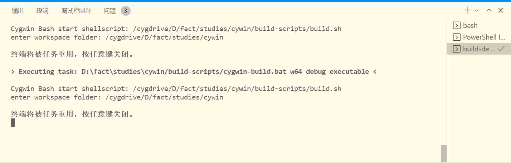

### vscode集成cygwin-gdb调试代码
**gdb.10在windows下集成vscode有问题，降级cygwin的gdb到9.2才能集成**
#### 启动配置launch.json[^vscode_cpp_debugging]
在vscode中，点击调试快捷按键或ctrl+shfit+D，vscode会自动给我们生成启动配置，选择c++ gdb。vscode的启动配置放在.vscode/launch.json中，
做如下修改
```json
{
	// 使用 IntelliSense 了解相关属性。 
	// 悬停以查看现有属性的描述。
	// 欲了解更多信息，请访问: https://go.microsoft.com/fwlink/?linkid=830387
	"version": "0.2.0",
	"configurations": [
		{
			"name": "(gdb) 启动", //名称，将会出现在vscode调试器的选项中
			"type": "cppdbg", //只能写cppdbg
			"request": "launch", // lunch还是attach，我们是启动，用lunch
			"program": "${workspaceFolder}/calc.exe", //要调试的程序
			"args": [], // 传递给被调试程序的参数
			"stopAtEntry": true, //程序运行到最后，终端会停止下来询问是否结束，而不会直接退出终端
			"cwd": "${workspaceFolder}", //程序运行的环境目录，相当于cd cwd;exec program
			"environment": [], //额外的环境变量
			"externalConsole": true, //是否使用外部的控制台。
			"MIMode": "gdb", //必须用这个值
			"miDebuggerPath": "c:\\cygwin64\\bin\\gdb.exe", //gdb的位置
			"setupCommands": [
				{
					"description": "为 gdb 启用整齐打印",
					"text": "-enable-pretty-printing",
					"ignoreFailures": true
				}
			]
		}
	]
}
```

#### 启动调试[^vscode_debugging]
在vscode 中按F5

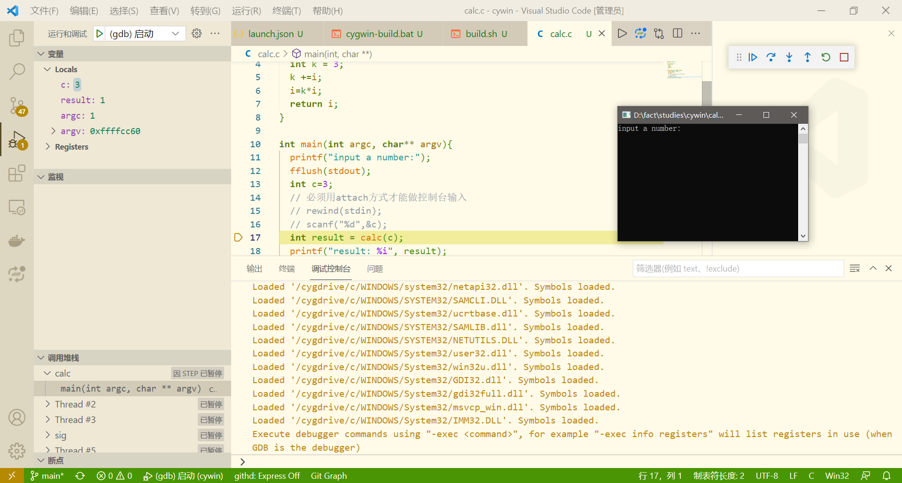
<!-- 
### 断点命令
用break或b命令设置断点
|命令|作用|
|-|-|
|break <function>|在进入指定函数时停住。 C++ 中可以使用 class::function 或 function(type,type) 格式来指定函数名。|
|break <linenum>|在指定行号停住。|
|break +<offset>,break -<offset>|在当前行号的前面或后面的 offset 行停住。 offiset 为自然数。|
|break filename:linenum|在源文件 filename 的 linenum 行处停住。|
|break filename:function|在源文件 filename 的 function 函数的入口处停住。|
|break *address|在程序运行的内存地址处停住。|
|break|break 命令没有参数时，表示在下一条指令处停住。|
|break ... if <condition>|... 可以是上述的参数， condition 表示条件，在条件成立时停住。比如在循环境体中，可以设置 break if i=100 ，表示当 i 为 100 时停住程序。|
查看断点时，可使用 info 命令，如下所示：（注： n 表示断点号）
    info breakpoints [n]
    info break [n]
-->

## 交叉编译相关配置
### build.sh添加平台、位数的判断代码
在build-scripts目录中添加脚本 build-variables.sh
```bash
#!/bin/bash
build_arch=$1
# platform
if [[ "$build_arch" =~ "w" ]]; then 
	build_platform=win
	build_staticSuffix=".lib"
	build_sharedSuffix=".dll"
	build_executableSuffix=".exe"
elif [[ "$build_arch" =~ "x" ]]; then
	build_platform=linux
	build_staticSuffix=".a"
	build_sharedSuffix=".so"
	build_executableSuffix=""
elif [[ "$build_arch" =~ "a" ]]; then
	build_platform=android
	build_staticSuffix=".a"
	build_sharedSuffix=".so"
	build_executableSuffix=""
elif [[ "$build_arch" =~ "m" ]]; then
	build_platform=mac
	build_staticSuffix=".a"
	build_sharedSuffix=".so"
	build_executableSuffix=""
else 
	build_platform=""
fi
if [ "$build_platform" == "" ]; then
	return
fi

echo "### Build variables"
printf "| varname\t\t| value\t| description\t|\n"
printf "| ----\t\t\t| ----\t| ----\t\t|\n"
printf "| build_platform\t| %s\t| 编译的目标操作系统:win,linux,android(arm),mac |\n" "$build_platform"

# bits
if [[ "$build_arch" =~ "32" ]]; then
	build_bits="32"
elif [[ "$build_arch" =~ "64" ]]; then
	build_bits="64"
else 
	build_bits="64"
fi
printf "| build_bits\t\t| %s\t| 编译目标的位数:32,64 |\n" "$build_bits"

# build mode
if [ "$2" == "debug" ] || [ "$2" == "release" ]; then
	build_mode=$2
else 
	build_mode=debug
fi
printf "| build_mode\t\t| %s\t| 编译类型: debug/release |\n" "$build_mode"

# suffixes
printf "| build_executableSuffix| %s\t| 可执行文件后缀 |\n" "$build_executableSuffix"
printf "| build_sharedSuffix\t| %s\t| 动态库文件后缀 |\n" "$build_sharedSuffix"
printf "| build_staticSuffix\t| %s\t| 静态库文件后缀 |\n" "$build_staticSuffix"
echo ""

# 编译器设置
echo "### Compiler variables"
if [ "$build_platform" == "win" ]; then
	if [ "$build_bits" == "64" ]; then
		export CC=/usr/bin/x86_64-w64-mingw32-gcc.exe
		export CXX=/usr/bin/x86_64-w64-mingw32-g++.exe 
	else
		export CC=/usr/bin/i686-w64-mingw32-gcc.exe
		export CXX=/usr/bin/i686-w64-mingw32-g++.exe 
	fi
else 
	echo "$build_arch is not suported yet"  || return
fi
printf "| varname\t| value\t\t\t\t\t| description\t|\n"
printf "| ----\t\t| ----\t\t\t\t\t| ----\t\t|\n"
printf "| CC\t\t| %s\t| C Compiler |\n" $CC
printf "| CXX\t\t| %s\t| C++ Compiler |\n" $CXX
echo ""


# 目录设置
echo "### Folder variables"
printf "| varname\t\t| value\t\t\t\t\t| description\t|\n"
printf "| ----\t\t\t| ----\t\t\t\t\t| ----\t\t|\n"
printf "| workspaceFolder\t| %s\t| 项目工作目录 |\n" "$workspaceFolder"
```

### 修改build.sh,根据参数调用不同的编译器
```bash
#!/bin/bash
# 获取并跳转到工作目录
buildScriptFolder=$(dirname "$0")
workspaceFolder="$buildScriptFolder/.."
cd "$workspaceFolder" || exit
workspaceFolder=$(pwd)

# 获取构建参数
source "$buildScriptFolder/build-variables.sh"


# 调用编译器生成代码
$CC -ggdb -o calc calc.c
```


## 参考文献 Reference
[^vscode_integrated_terminal]:[Integrated Terminal](https://code.visualstudio.com/docs/editor/integrated-terminal)
[^vscode_tasks]:[Integrate with External Tools via Tasks](https://code.visualstudio.com/docs/editor/tasks)
[^vscode_debugging]:[vscode debugging](https://code.visualstudio.com/docs/editor/debugging)
[^vscode_cpp_debugging]:[Configuring C/C++ debugging](https://code.visualstudio.com/docs/cpp/launch-json-reference)